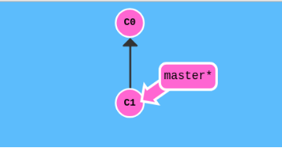
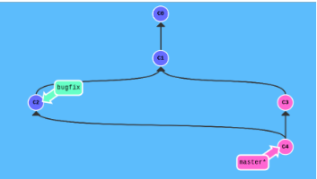

# Machine Learning Engineer Nanodegre ND009t

### Quiz Week 19, 2019

**Q1:** When the code below is run, the final position of all robots is same. Which function contains a bug causing this anamoly?

```python
class robot(object):
    def __init__(self,x,y,theta):
        self.x = x
        self.y = y
        self.theta = theta

    def rotate(self, theta):
        self.theta = theta

    def move(self, speed, time):
        self.x += speed * np.cos(self.theta) * time
        self.y += speed * np.sin(self.theta) * time

    def __str__(self):
        return str(np.round(self.x,2))+','+str(np.round(self.y,2))


def test_robots():        
    r1, r2, r3 = [robot(0,0,0)]*3
    r2.rotate(np.pi/2)
    r3.rotate(np.pi)
    r1.move(2,1);r2.move(1,3);r3.move(3,2)
    print(f"{r1},{r2},{r3}")

test_robots()
```


1. `robot.rotate()`
2. `robot.move()`
3. `robot.__str__()`
4. `test_robots()`

**Answer:4**


**Q2**: Which sequence of git commands would result in the commit graph changing from:


to 



1. git checkout -b bugfix > git commit > git branch master > git commit > git merge
2. git checkout -b bugfix > git commit > git checkout master > git commit > git merge
3. git commit > git branch bugfix > git checkout bugfix > git commit > git merge master
4. git commit > git branch bugfix > git checkout bugfix > git commit > git checkout master > git pull bugfix

**Answer:4**


**Q3**: Which of the four options is semantically equivalent to the code below but is more readable:

```
result_x = []
result_y = []
for x in list1:
    for y in list2:
    if prob(x)*prob(y) > 1e-4:
        result_x.append(x)
        result_y.append(y)
```       

1.
```
z = [(x,y) for x in list1 for y in list2]
f = filter(lambda a ,b: prob(a)*prob(b) > 1e-4, z)
u = zip(*f)
result_x, result_y = map(list, u)
```
2.
```
z = [(x,y) for x in list1 for y in list2]
f = filter(lambda t: prob(t[0])*prob(t[1]) > 1e-4, z)
u = zip(*f)
result_x, result_y = map(list, u)
```

3.
```
z = zip(list1, list2)
f = filter(lambda t: prob(t[0])*prob(t[1]) > 1e-4, z)
u = zip(*f)
result_x, result_y = map(list, u)
```

4.
```
z = zip(list1, list2)
f = filter(lambda a, b: prob(a)*prob(b) > 1e-4, z)
u = zip(*f)
result_x, result_y = map(list, u)
```
**Answer:2**


**Q4:** Suppose you discover a new unsupervised learning algorithm similar to PCA. The algorithm can be trained on a dataset and discovers new dimesnions on to which an existing dataset can be projected to get new features. You want to contribute your algorith to the sklearn codebase. Which of the following APIs should an implementation of the algorithm provide?

1. fit(), fit_predict(), fit_transform(), predict(), transform()
2. fit(), fit_predict(), predict()
3. fit(), fit_transform(), transform()
4. fit(), fit_transform()

**Answer:3**


**Q5:** Which of the following git command will fix a typo in the last commit without creating a new commit?


1. 
```git checkout head^ 
git merge master -m 'new commit message'
```

2.
```
git revert 
git commit -m 'new commit message'
```

3.
```
git commit --amend -m 'new commit message'
```

4.
```
git reset head^
git commit -m 'new commit message'
```

**Answer:3**


### Quiz Week of Jun 10, 2019

**Q1:** Which of the following is a deep learning framework wrtitten in C++ with APIs wtritten in C++ too, and can be deployed on small devices like phones?

1. Theano
2. Caffe
3. Chainer
4. Keras

**Answer:2**

**Q2:** Which of the following is a standard for describing machine learning models in a portable way?

1. XML
2. YML
3. JSON
4. ONNX

**Answer:4**


**Q3:** What is an end point in the context of a web application running a machine learning model?

1. An endpoint is a file containing the model's parameters.
2. An endpoint is a piece of code, written in any language, running on a server, that directly receives user input over a remote connection. 
3. An endpoint will be a python interpreter running on a remote server.
4. An endpoint will be a piece of code that converts Python code received from a client into C++ code.

**Answer:2**

**Q4:** Which of the following formats is typically not used to send data back from an endpoint?
1. XML
2. JSON
3. Protobuf
4. ELF 

**Answer:4**


**Q5:** Docker containers are used to
1. Reduce the size of the model when deploying to a remote server.
2. Wrapping machine learning models in platform specific APIs
3. Package an application and its dependencies in an environment that can be run across platforms 
4. Make the model independent of any machine learning framework.

**Answer:3**


