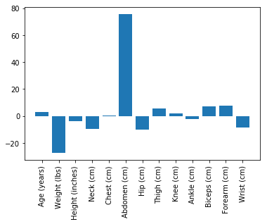
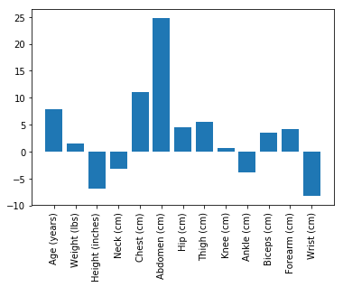
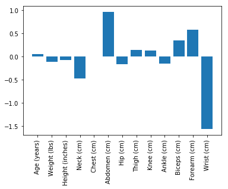

# Intro to Machine Learning nd229

### Quiz Week 19, 2019

**Q1:**


Which of the following equations comes closest to approximating the data above:
1. 

2. 

3. 

4. 

**Answer:2**

**Q2:**
```Python
food = ['🍕', '🥗', '🌯', '🧀', '🍔']
calories = [630, 115, 320, 800, 450]
```
How do you get a list of food items and their associated calorific value?

1. `sorted(food, key=calories)`
2. `sorted(zip(calories, food), key=lambda x:x[1])`
3. `sorted(zip(food, calories), key=lambda x:x[0])`
4. `sorted(zip(food, calories),key=lambda x:x[-1])` 

**Answer:4**

**Q3:**
For what value(s) of `x` is **|x+1| + |x-2|** minimized?
1. 3
2. 2
3. 0.5
4. 0

Answer: 2,3,4

**Q4:**
What can be inferred from the plot of a machine learning model trying to predict weight from abdomen measurements, as shown below?


1. If the units of weight or height are changed, the model will change.
2. The model is predominanntly overestimating the weight.
3. The data likely contains an outlier.
4. The constant term in the equation of the model is negative.

**Answer:1,3,4**


**Q5:**
Suppose you train three different models for predicting body fat from different body measurements.





Based on our understanding of the world, rate the effectiveness of the models.

1. I > II > III
2. II > I > III
3. III > I > II
4. III > II > I

**Answer:2**


### Quiz Week of Jun 10, 2019

**Q1:**
Which SciKit Learn API will let you create polynomial features? For example if the original features are x1, x2 and x3 and you want to use x1, x2, x3, x1^2, x2^2, x3^2, x1\*x2, x2\*x3, x3\*x1 as new features.

1. sklearn.linear_model.Ridge
2. sklearn.preprocessing.PolynomialFeatures
3. sklearn.model_selection.PolynomialFeatures
4. sklearn.feature_selection.VarianceSelection

**Answer:2**

**Q2:**
Which class provides L1 regularized linear regression?

1. SGD
2. Ridge
3. Lasso
4. LinearRegression

**Answer:3**

**Q3:**
Which is true regarding the line 3x-2y+5 = 0, the points (0,0) and (-2,3).

1. Both (0,0) and (-2,3) are above the line.
2. Both (0,0) and (-2,3) are below the line.
3. (0,0) is above the line but (-2,3) is below it.
4. (0,0) is below the line but (-2,3) is above the line.

**Answer:3**

**Q4:**
Given the matrices, W, X and b such that X\*W = b, if W has shape (13, 1) and b has shape (212,1), what is the shape of X?

1. (212,1)
2. (13,212)
3. (1,13)
4. (213,13)

**Answer:4**

**Q5:**
Similar to AND, NOT, and XOR, consider a function PARITY that takes 3 inputs x, y and z. The output of the Parity function is one if an odd number of its inputs are 1 and 0 if an even number of inputs are 1. Which of the following correctly computes the parity function:

1. Parity(x,y,z) = OR(XOR(x,y), XOR(y,z))
2. Parity(x,y,z) = AND(XOR(x,y), z)
3. Parity(x,y,z) = OR(XOR(x,y), z)
4. Parity(x,y,z) = XOR(XOR(x,y), z)

**Answer:4**


### Quiz Week of July 1, 2019

**Q1:** When using the `sklearn.linear_model.SVC`, which parameter controls overfitting:

1. Lambda
2. Gamma
3. C
4. epsilon

**Answer:3**

**Q2:** Which of the following is TRUE regarding sklearn.svm.LinearSVC(C1) vs sklearn.svm.SVC(C2) versions of SVM algorithm?

1. Only C1 allows polynomial kernels.
2. Only C2 allows linear kernels.
3. Only C1 supports classifying more than one two classes.
4. Both C1 and C2 support linear SVMs.

**Answer:4**


**Q3:** Which of the following does NOT use an ensemble of weak classifiers

1. DecisionTreeClassifier
2. AdaBoostClassifier
3. RandomForestClassifier
4. Voting Classifier

**Answer:1**

**Q4:** Which of the following is TRUE?

1. Confusion matrix is only useful to evaluate a binary classifier (two target classes).
2. If we reduce the classification threshold, the number of true positives is likely to go up.
3. If we increase a classifier's threshold, the number of false negatives will likely go up.
4. A positive sample will be either classified as a true positive or a false positive.

**Answer:3**


**Q5:** Which of the following does NOT require using Grid Search and Cross Validation

1. The best classifier from a set of classifiers for a task.
2. The best regressor from a set of regressors.
3. The depth of a decision tree classifier.
4. Finding the learning curve for a classifier.

**Answer:4**
