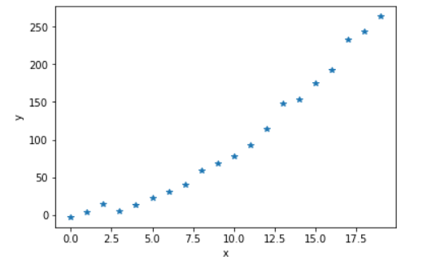
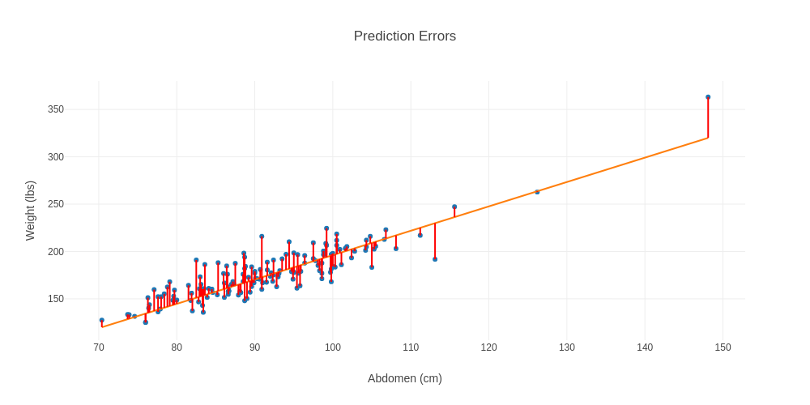

# Intro to Machine Learning nd229

### Quiz 

**Q1:**



Which of the following equations comes closest to approximating the data above:
1. 

2. 

3. 

4. 

**Answer:2**

**Q2:**
```Python
food = ['🍕', '🥗', '🌯', '🧀', '🍔']
calories = [630, 115, 320, 800, 450]
```
How do you get a list of food items and their associated calorific value?

1. `sorted(food, key=calories)`
2. `sorted(zip(calories, food) key=lambda x:x[1])`
3. `sorted(zip(food, calories) key=lambda x:x[0])`
4. `sorted(zip(food, calories),key=lambda x:x[-1])` 

**Answer:4**

**Q3:**
For what value(s) of `x` is **|x+1| + |x-2|** minimized?
1. 3
2. 2
3. 0.5
4. 0

Answer: 2,3,4

**Q4:**
What can be inferred from the plot of a machine learning model trying to predict weight from height, shown below?


1. If the units of weight or height are changed, the model will change.
2. The model is predominanntly overestimating the weight.
3. The data likely contains an outlier.
4. The constant term in the equation of the model is negative.

**Answer:1,3,4**
