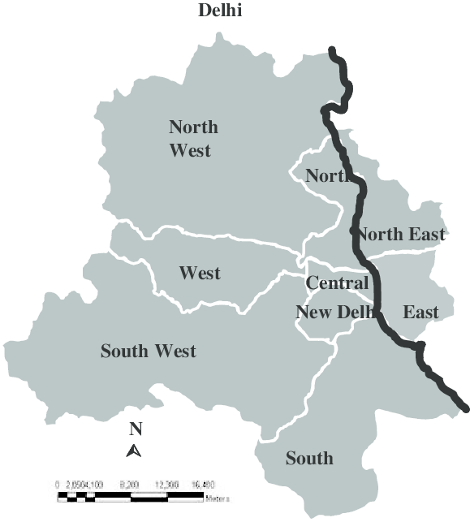

# Artifical Intelligence Nanodegree (ND898)

### Quiz Week 19, 2019

**Q1:** Which of the following games can be played by an AI agent using constraint satisfaction?
1. Chess
2. Minesweeeper
3. Roulette
4. Crosswords

**Answer:2,4**

**Q2:** In the map of the districts of Delhi shown below, which state is the least constrained when it comes to coloring the map under the constraint that no two adjacent districts share a color?

